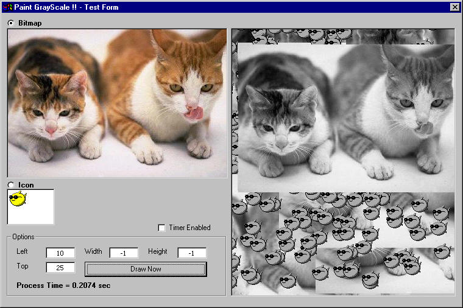



## PaintGrayScale \- \[Hi speed image GrayScale function for Usercontrols\.\.\. Icons supported\!\!\]

### Description

Hi guys, This is a rock solid hi-speed code(DIB) for image GrayScale. GrayScales are very important especially for usercontrols to draw disabled states!! I can't find any stand-alone hi-speeed code for this. And none of them supports icons too...(icons are very important for uc). So here is it... you can pass Bitmaps as well as icons to this function. The transparency of icons will be retained with absolutly no memory leak!!! Check this out and give me ur feedbacks...   And one more... Merry X'Mas and Happy NewYear!!, Jim Jose :)
 
### More Info
 

             |
---                |---
**Submitted On**   |2005-08-09 15:30:50
**By**             |[JJJJJJJJ](https://github.com/Planet-Source-Code/PSCIndex/blob/master/ByAuthor/jjjjjjjj.md)
**Level**          |Intermediate
**User Rating**    |5.0 (65 globes from 13 users)
**Compatibility**  |VB 6\.0
**Category**       |[Graphics](https://github.com/Planet-Source-Code/PSCIndex/blob/master/ByCategory/graphics__1-46.md)
**World**          |[Visual Basic](https://github.com/Planet-Source-Code/PSCIndex/blob/master/ByWorld/visual-basic.md)
**Archive File**   |[PaintGrayS19589212222005\.zip](https://github.com/Planet-Source-Code/jjjjjjjj-paintgrayscale-hi-speed-image-grayscale-function-for-usercontrols-icons-supported__1-63750/archive/master.zip)

